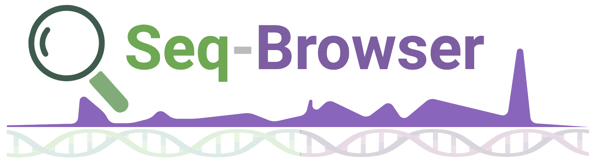

# Seq-Browser 

A browser for sequencing assays

## Overview

The Seq-Browser database holds all current next-generation-sequencing based methods that have been released by publication or pre-print via a web crawling algorithm.

## Rationale

Frederick Sanger's invention of DNA sequencing in the 1970s allowed scientists to "read" the genome. This method called Sanger sequencing utilized the concept of dideoxy chain termination to sequence DNA and lead to the sequencing of the entire human genome in 2003, costing $3B USD.

In the early 2000s, next-generation sequencing (NGS) methods were developed that quickly expanded the capabilities of genomics research, allowing scientists to sequence the genome of an organism at an unprecedented level of detail. Such technologies have led to the success of large-scale sequencing projects such as The Cancer Genome Atlas (TCGA) and Encyclopedia of DNA Elements (ENCODE), which greatly accelerate the rate of basic and translational biomedical research.

In recent years, there has been a remarkable explosion of different sequencing assays that can profile not just DNA, but also RNA, protein, and/or epigenetic modifications. Whilst most new methods rely on the NGS platform, some may utilise microfluidic systems (to profile single cells), or microscopy-based platforms (to preserve spatial information). Anyhow, such emerging methods are being released to the scientific community at a blinding rate.

We created Seq-Browser to catalogue and maintain an up-to-date database of sequencing methods that can be easily browsed at <website-link>
